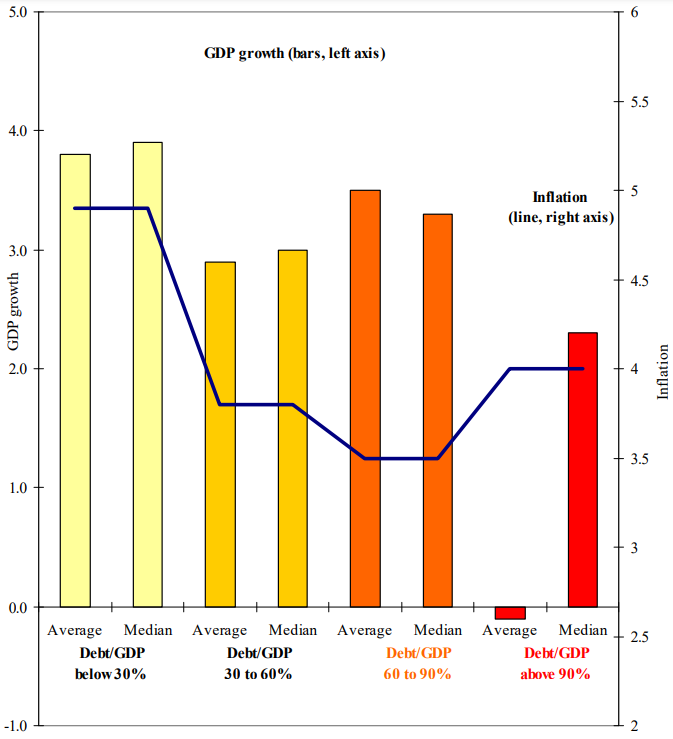

POST BENG DRAFTED - TEST POST

In January 2010, an economics paper took the world by storm.

This paper, authored by renowned economists Carmen Reinhart and Ken Rogoff, explored the relationship between debt and economic growth.^[Reinhart CM, Rogoff KS. Growth in a Time of Debt. American Economic Review. 2010;100(2):573-8. doi: 10.1257/aer.100.2.573] A key finding was that developed economies had a fiscal cliff: when government debt exceeded 90 per cent of GDP, economic growth suffered:

```{r, echo = FALSE, fig.align = 'center', out.width = '60%', results = 'markup'} 


```

This charts tells me two things. Firstly, that Reinhart and Rogoff desperately need a chart stylist; and secondly, that there is a *freaking huge* difference between the mean and the median GDP growth for countries with a debt/GDP ratio exceeding 0.9.

In layperson's terms: if your government debt tips over the magic threshold from 90 to 91 per cent, your GDP growth drops from around +3.5 to -0.1 ... mystery units.^[which I assume, from reading the article, is meant to be per cent... please, always label your axes with units as well as intervals] 

High debt = low growth. Simples!

Governments embraced these findings to justify austerity measures targeted at reducing public debt^[Inman P. Rogoff and Reinhart defend their numbers: The Guardian; 18 April 2013 (accessed 10 November 2020). Available from: https://www.theguardian.com/business/economics-blog/2013/apr/17/rogoff-reinhart-defend-debt-study] ^[Krugman P. The case for cuts was a lie. Why does Britain still believe it? - The austerity delusion: The Guardian; 29 April 2015 (accessed 10 November 2020). Available from: https://www.theguardian.com/business/ng-interactive/2015/apr/29/the-austerity-delusion] in the global aftermath of the collapse of the US banking sector in 2007-08.

This is the sort of finding that you would think justifies a quick double-check of your data. If you handed me this paper for publication, you can betcha I would ask to see your source data and code.


But when PhD student Thomas Herndon set out to replicate the findings of Reinhart and Rogoff in a graduate class assignment two years later, he found major flaws. Not only were there formula errors in the Excel spreadsheet used by Reinhart and Rogoff, but questionable weightings had been applied to the countries in the analysis. (4-6) Once these issues were corrected, the fiscal cliff vanished. (3-6) In addition, questions were raised about the causal direction of the relationship – rather than high debt causing slow growth, economists began to question whether it was instead slow growth that caused high debt. (3)

Herndon’s debunking research, published in 2013, coincided with most developed countries beginning to abandon austerity. (3) However, despite increasing evidence that austerity was not an economic silver bullet, (3) the UK government has held firmly to austerity measures such as cuts to welfare payments and social services since 2010, citing Greece as an example of an economy in crisis. (3, 7) Recent criticism has focused heavily on increases in poverty, food shortages and crime in the UK under austerity measures. (7)

The Reinhart and Rogoff controversy highlighted three major problems in the relationship between science and politics: first, that a single paper could be used to justify broad-reaching government responses to major social crises; second, that even after major flaws with this paper were discovered, governments continued to argue that the austerity approach to managing debt was supported by evidence; and third, that people re-elected a government committed to policy based on long-discredited research.

```{r, echo = FALSE, fig.align = 'center', out.width = '60%', results = 'markup'} 
library(ggplot2)
library(RColorBrewer)
theme_set(theme_bw())

gdp_growth <-c(3.8,3.9,2.9,3.0,3.5,3.3,-0.1,2.3)
inflation <- c(4.9,4.9,3.8,3.8,3.5,3.5,4.0,4.0)
id <- c(1:8)
stat <- rep(c("Average","Median"),4)
group <- c(" Debt/GDP below 30%"," Debt/GDP below 30%","Debt/GDP 30% to 60%","Debt/GDP 30% to 60%","Debt/GDP 60% to 90%","Debt/GDP 60% to 90%","Debt/GDP above 90%","Debt/GDP above 90%")
dat <- data.frame(id,group,stat,gdp_growth,inflation)
dat
ggplot(dat) + 
  geom_bar(aes(fill=stat,y=gdp_growth,x=id), position="dodge",stat="identity") + 
  geom_line(aes(x=id,y=inflation-2)) +
  scale_fill_brewer(palette="YlOrRd")  +
  scale_y_continuous(name="GDP growth",limits=c(-1.0,5.0),sec.axis=sec_axis(~.+2, name = "Inflation"))


```


```{r setup, include=FALSE}
knitr::opts_chunk$set(echo = FALSE)
```
